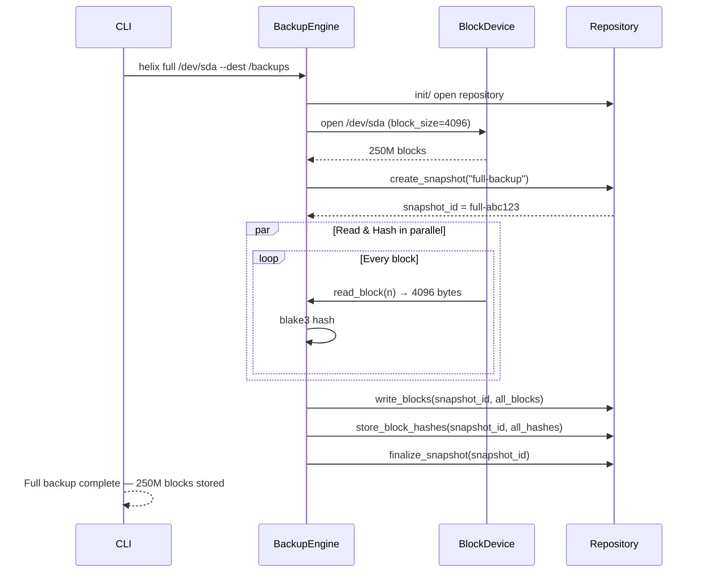
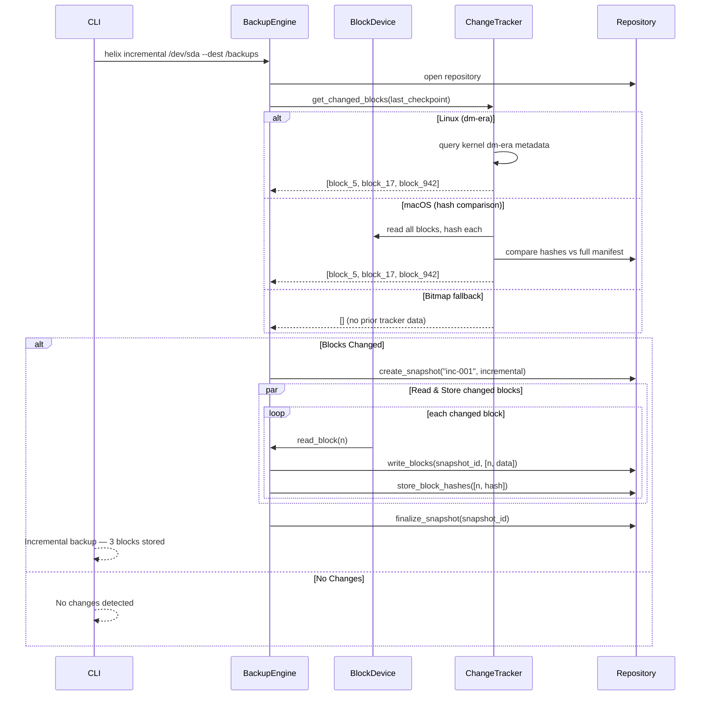
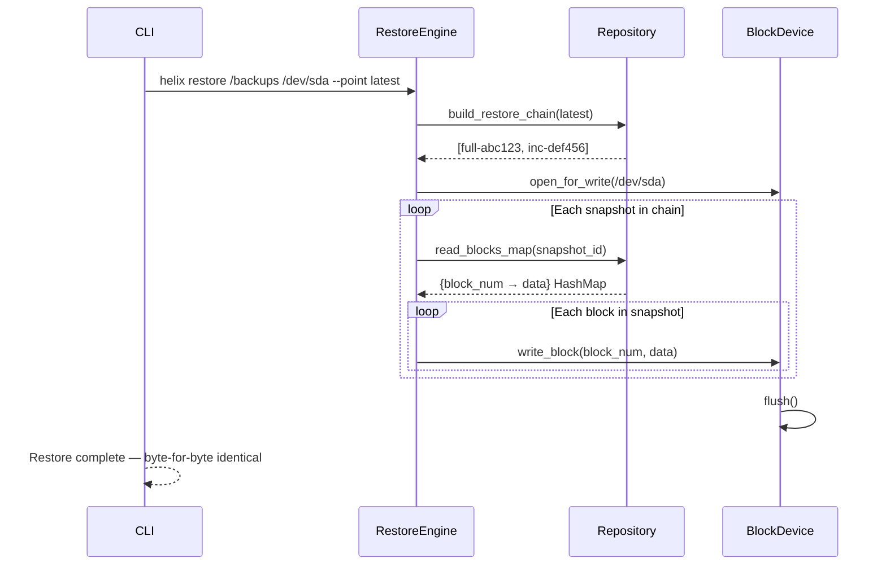

# HELIX — Block-Level Backup Engine

> **Problem:** Traditional backup tools (rsync, tar, Time Machine) operate at the file level. They depend on filesystem metadata, slow down on millions of small files, and waste space storing unchanged data blocks. On raw block devices or exotic filesystems, they simply don't work.

> **Solution:** HELIX reads raw block devices, tracks changes at the sub-file block level, and stores only what changed. It is filesystem-agnostic — ext4, NTFS, APFS, XFS, ZFS — and delivers full + incremental backups without ever asking the filesystem for a file list.

[](https://github.com/helix/helix/actions/workflows/ci.yml)
[](LICENSE)


---

## How It Works

### Full Backup

Every block on the source device is read, hashed with blake3, and written to the repository. The manifest stores the block→hash map for change detection later.



**On disk after full backup:**
```
/backups/
├── metadata.json
├── index.db
└── Full/
    └── full-abc123/
        ├── blocks.dat       ← 250M blocks × 4096 B = raw data
        └── manifest.json    ← 250M blake3 hashes
```

---

### Incremental Backup

Only blocks whose content changed since the last checkpoint are read and stored. Change detection uses the best method available per platform.



**On disk after incremental backup:**
```
/backups/
├── metadata.json
├── index.db
├── Full/
│   └── full-abc123/
│       ├── blocks.dat       ← 250M blocks (baseline)
│       └── manifest.json
└── Incremental/
    └── inc-def456/
        ├── blocks.dat       ← 3 blocks (only what changed)
        └── manifest.json    ← parent_id: full-abc123
```

---

### Restore

The restore engine walks the snapshot chain (full → incremental → ...), reads each snapshot's `blocks.dat`, and writes every block to its correct position on the target device.



---

## Quick Start

```bash
# 1. Initialize a repository
helix init /var/helix/backups

# 2. Full backup of a disk
sudo helix full /dev/sda --dest /var/helix/backups --label initial

# 3. Later — incremental backup (only changed blocks)
sudo helix incremental /dev/sda --dest /var/helix/backups --label daily-001

# 4. Restore the latest state
sudo helix restore /var/helix/backups /dev/sda --point latest

# 5. Verify integrity
helix check /var/helix/backups
```

---

## Walkthrough — What Gets Created

Run these commands on a test file to see every file HELIX creates:

```bash
# Create a small test disk (512 KB, 128 blocks of 4096 bytes)
python3 -c "
import struct
with open('/tmp/test-disk.img', 'wb') as f:
    for i in range(128):
        f.write(struct.pack('<Q', i) * 512)
"

# Init repository
helix init /tmp/helix-repo

# Full backup
helix full /tmp/test-disk.img --dest /tmp/helix-repo --label initial

# Modify one block
python3 -c "
with open('/tmp/test-disk.img', 'r+b') as f:
    f.seek(5 * 4096)
    f.write(b'MODIFIED' + b'\x00' * 4087)
"

# Incremental backup
helix incremental /tmp/test-disk.img --dest /tmp/helix-repo --label inc-day1
```

**Output files generated:**

```
/tmp/helix-repo/
├── metadata.json              (164 bytes)
├── index.db                   (37 KB)
├── Full/
│   └── full-<uuid>/
│       ├── blocks.dat         (526 KB — all 128 blocks)
│       └── manifest.json      (63 KB — 128 hashes)
└── Incremental/
    └── inc-<uuid>/
        ├── blocks.dat         (4 KB — only block 5)
        └── manifest.json      (867 bytes — 1 hash + parent_id)
```

### File Contents

**`metadata.json`** — repository-wide configuration:
```json
{
    "version": 1,
    "created_at": "2026-07-22T12:29:37Z",
    "block_size": 4096,
    "compression_level": 3,
    "encrypted": false,
    "total_snapshots": 2
}
```

**`index.db`** — SQLite database with 3 tables:
```
snapshots    → id, timestamp, backup_type, block_count, label, parent_id
checkpoints  → id, timestamp, block_count, tracking_method
block_index  → block_number, snapshot_id, offset, size, hash
```

**`Full/*/blocks.dat`** — binary format, all blocks concatenated:
```
[block_0: u64 LE][size: u32 LE][4096 bytes data]
[block_1: u64 LE][size: u32 LE][4096 bytes data]
...
[block_127: u64 LE][size: u32 LE][4096 bytes data]
```

**`Full/*/manifest.json`** — metadata + every block's blake3 hash:
```json
{
    "snapshot_id": "full-abc123",
    "backup_type": "full",
    "block_count": 128,
    "block_size": 4096,
    "label": "initial",
    "completed": true,
    "block_hashes": [
        {"block_number": 0, "hash": "ab12cd...", "block_size": 4096},
        {"block_number": 1, "hash": "ef34gh...", "block_size": 4096},
        ...
    ]
}
```

**`Incremental/*/blocks.dat`** — same binary format, only changed blocks:
```
[block_5: u64 LE][size: u32 LE][4096 bytes modified data]
```

**`Incremental/*/manifest.json`** — includes `parent_id` linking to full:
```json
{
    "snapshot_id": "inc-def456",
    "backup_type": "incremental",
    "block_count": 1,
    "parent_id": "full-abc123",
    "block_hashes": [
        {"block_number": 5, "hash": "56ij78...", "block_size": 4096}
    ]
}
```

### Restore Verification

```bash
# Restore and verify byte-for-byte
helix restore /tmp/helix-repo /tmp/restored.img --point latest
shasum -a 256 /tmp/test-disk.img /tmp/restored.img
# Both SHA256 hashes will match exactly
```

---

## Cross-Platform Change Detection

| Platform | Method | Overhead |
|---|---|---|
| Linux | `dm-era` kernel target (ioctl) | Near zero — kernel tracks dirty blocks |
| macOS | blake3 hash comparison against manifest | Reads all blocks, hashes, compares |
| Fallback | Software bitmap | Tracks writes via notify/scan |

---

## Repository Layout

```
/var/helix/backups/
├── metadata.json           # Repo version, block_size, snapshot count
├── index.db                # SQLite: snapshots + checkpoints + block index
├── Full/
│   └── full-<uuid>/
│       ├── blocks.dat      # Binary: [block_num:u64][data_size:u32][data...]
│       └── manifest.json   # blake3 hashes + metadata
└── Incremental/
    └── inc-<uuid>/
        ├── blocks.dat      # Only changed blocks (same binary format)
        └── manifest.json   # parent_id links to full backup
```

---

## Features

- **Filesystem agnostic** — reads raw blocks, works on ext4, NTFS, APFS, XFS, ZFS
- **Incremental backups** — only changed blocks, verified by blake3 hash
- **AES-256-GCM encryption** — optional, data at rest
- **ZSTD compression** — optional, levels 1–22
- **SQLite index** — fast metadata queries, restore chain resolution
- **Parallel I/O** — rayon-based multi-threaded block reading

---

## Testing

```bash
cargo test --lib     # 33 unit tests
cargo build --release
```

---

## License

MIT
