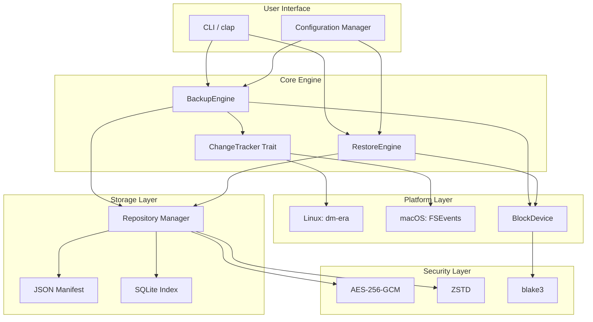
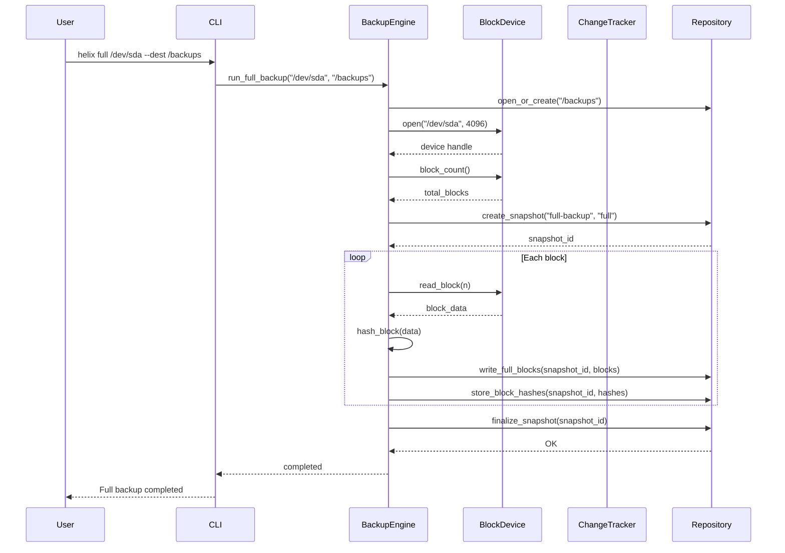
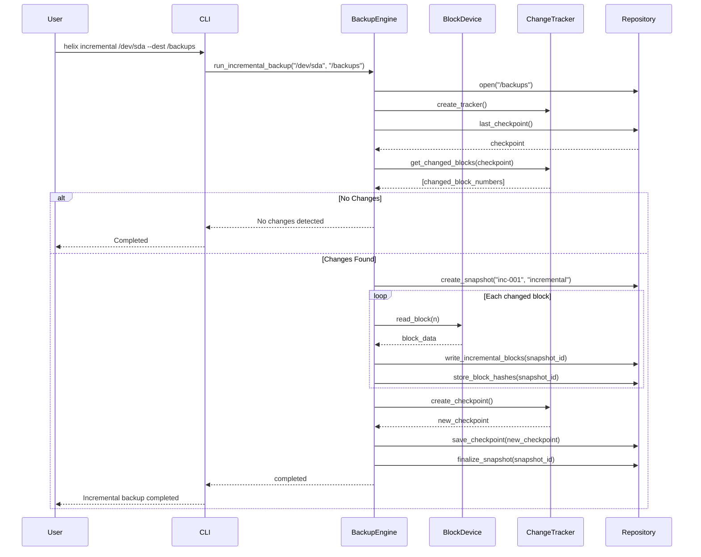
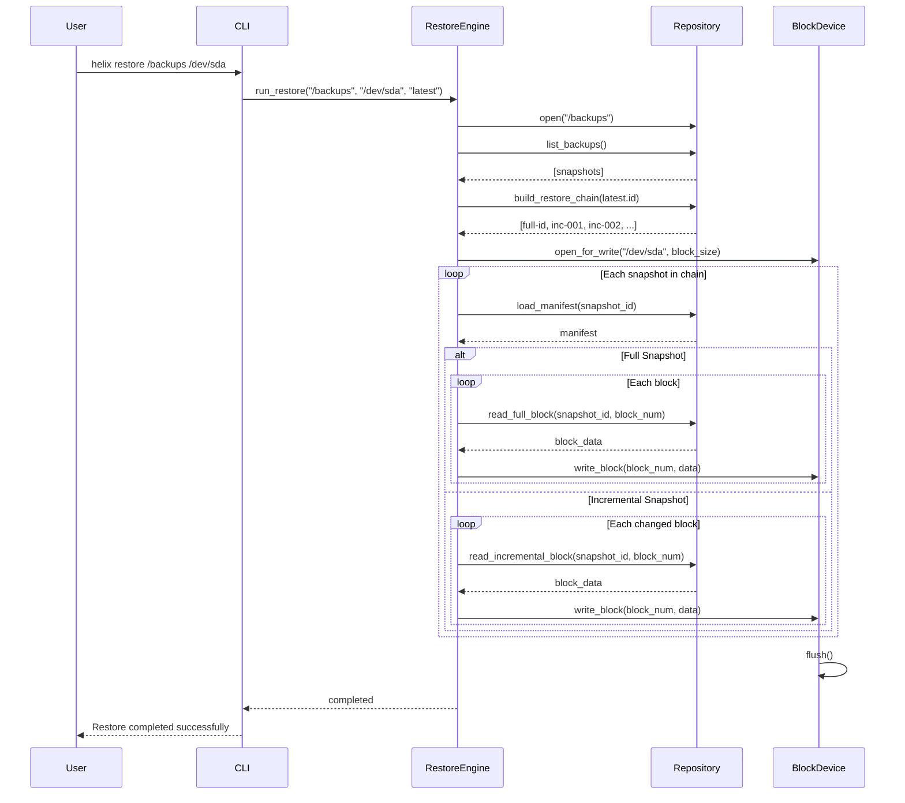
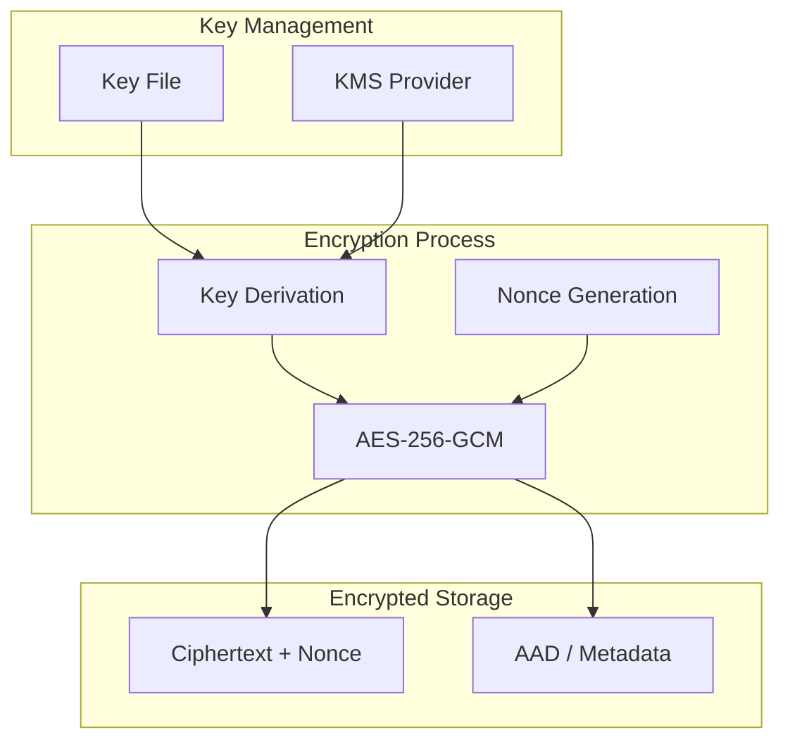

# HELIX Architecture Guide

## System Overview

HELIX is a block-level backup engine that operates directly on raw block devices. It reads data in fixed-size blocks, tracks which blocks change between backups, and stores only the changed blocks in incremental snapshots. This architecture makes it filesystem-agnostic — it does not need to understand ext4, NTFS, APFS, or any other filesystem structure.

### Core Design Principles

1. **Block-Level Operation** — All I/O happens at the block level, bypassing filesystem metadata
2. **Efficient Change Tracking** — Only changed blocks are stored in incremental backups
3. **Verifiable Integrity** — Every block is hashed with blake3 for integrity verification
4. **Cross-Platform Abstraction** — Platform-specific change tracking is abstracted behind a trait
5. **Defense in Depth** — Optional encryption (AES-256-GCM) and compression (ZSTD)

## Component Architecture



## Backup Flow



## Incremental Backup Flow



## Restore Flow



## Cross-Platform Strategy

### Linux: dm-era Change Tracking


On Linux, HELIX uses the Device Mapper era target (`dm-era`) for efficient block-level change tracking. The `dm-era` target maintains metadata about which blocks have changed since a given checkpoint. HELIX queries this metadata to identify changed blocks for incremental backups.

- Zero overhead for unchanged blocks
- Kernel-level change tracking
- Persistent metadata across reboots

### macOS: FSEvents Change Tracking


On macOS, HELIX uses the FSEvents API for file-level change detection. File changes are mapped to block numbers using APFS extent information. The mapping from files to blocks is maintained in an SQLite store.

- Uses OS-native file change notifications
- Maps file changes to block numbers
- Persistent checkpoint state in SQLite

### Fallback: Dirty Bitmap

For systems without hardware change tracking support, HELIX includes a software bitmap-based tracker that records all writes and compares block hashes to detect changes.

## Data Flow

### Write Path (Backup)

```
Block Device → Read Block → blake3 Hash → [Optional: Encrypt] → [Optional: Compress] → Write to Repository
```

### Read Path (Restore)

```
Repository → Read Block Data → [Optional: Decompress] → [Optional: Decrypt] → Verify blake3 Hash → Write to Device
```

## Security Model

### Encryption Architecture



- **Algorithm**: AES-256-GCM (authenticated encryption)
- **Key Size**: 256 bits
- **Nonce**: 96-bit random per encryption operation
- **Integrity**: GCM provides authentication tag
- **Key Storage**: File-based or external KMS

## Performance Considerations

### Block Size Selection

| Block Size | Full Backup Speed | Incremental Granularity | Storage Overhead |
|---|---|---|---|
| 512 B | Slow | Fine | Low |
| 4 KB | Fast | Good | Medium |
| 64 KB | Very Fast | Coarse | High |
| 1 MB | Maximum | Very Coarse | Very High |

### I/O Concurrency

- Uses `rayon` for parallel block processing
- Configurable I/O concurrency limit
- Direct I/O support on Linux for raw device access
- Throttling capability for production environments

## Testing Strategy

### Unit Tests

- Every module has comprehensive unit tests
- Mock external dependencies (block devices, trackers)
- Test error handling and edge cases
- Use `rstest` for parameterized testing

### Integration Tests

- Full backup/restore cycle with temporary files
- Cross-platform testing in CI
- Repository validation tests
- Encryption/compression round-trip tests

### Performance Tests

- Benchmark with `cargo bench`
- Measure throughput for various block sizes
- Profile memory usage
- Track I/O patterns

## Deployment

### Production Requirements

- **Linux**: Linux kernel 5.4+, `dm-era` kernel module, 256 MB RAM, 1 CPU core
- **macOS**: macOS 11+, 512 MB RAM, 1 CPU core
- **Storage**: Sufficient space for backup repository (plan for 2x backup size during operations)

### Security Recommendations

1. Run with minimum required privileges
2. Store encryption keys separately from backup data
3. Enable integrity verification
4. Regular repository validation (`helix check`)
5. Off-site backup of repository metadata
