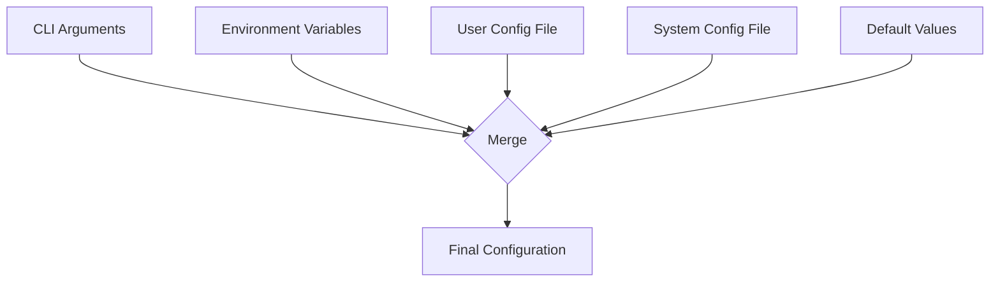

# HELIX Configuration Guide

## Configuration Sources (Priority Order)

1. **CLI arguments** — Highest priority, overrides all other sources
2. **Environment variables** — `HELIX_*` prefixed variables
3. **User config file** — `~/.config/helix/config.yaml` (Linux) or `~/Library/Application Support/helix/config.yaml` (macOS)
4. **System config file** — `/etc/helix/config.yaml`
5. **Default values** — Lowest priority, built into the binary

## Loading Order



## Full Configuration Schema

```yaml
# =============================================================================
# HELIX Configuration - Complete Schema
# =============================================================================

# Block size in bytes (must be power of two: 512, 4096, 8192, 65536, etc.)
block_size: 4096

# ZSTD compression level (1-22, 0 = disabled)
compression_level: 3

# =============================================================================
# Encryption Settings
# =============================================================================
encryption:
  # Enable AES-256-GCM encryption
  enabled: false

  # Path to encryption key file (256-bit key as hex)
  key_path: null

  # Cipher to use (currently only aes-256-gcm)
  cipher: aes-256-gcm

  # External KMS provider (optional)
  kms_provider: null

# =============================================================================
# Storage Settings
# =============================================================================
storage:
  # Default path for backup repository
  repository_path: /var/helix/backups

  # Temporary directory for in-flight operations
  temp_path: null

  # Maximum parallel I/O operations
  max_parallel_io: 4

  # Compression settings
  compression:
    enabled: false
    level: 3
    algorithm: zstd

# =============================================================================
# Backup Settings
# =============================================================================
backup:
  # Paths to exclude from backup
  exclude_paths: []

  # Paths to explicitly include
  include_paths: []

  # Number of days to retain backups
  retention_days: 30

  # Scheduled backup configuration
  schedule:
    enabled: false
    interval: daily
    time: "02:00"

  # Pre-backup hook script
  pre_backup_hook: null

  # Post-backup hook script
  post_backup_hook: null

  # Verify blocks after backup completes
  verify_after_backup: true

# =============================================================================
# Performance Settings
# =============================================================================
performance:
  # Read/write buffer size in MB
  buffer_size_mb: 64

  # Use direct I/O (bypasses OS cache, Linux only)
  direct_io: true

  # Throttle I/O to this speed (MB/s, null = unlimited)
  throttle_mbps: null

  # Number of worker threads
  thread_count: 4

# =============================================================================
# Change Tracking Settings
# =============================================================================
tracking:
  # Tracking method: dm-era (Linux), fsevents (macOS), bitmap, manual
  method: auto

  # Checkpoint interval in seconds
  checkpoint_interval_secs: 300

  # Path to persist tracking state (optional)
  persist_path: null

# =============================================================================
# Restore Settings
# =============================================================================
restore:
  # Verify block hashes during restore
  verify_blocks: true

  # Overwrite existing data without confirmation
  overwrite: false

  # Perform dry run (show what would be restored)
  dry_run: false

# =============================================================================
# Logging Settings
# =============================================================================
logging:
  # Log level: trace, debug, info, warn, error
  level: info

  # Log file path (null = stderr)
  file: null

  # Log format: text, json
  format: text
```

## Environment Variables

| Variable | Description | Default |
|---|---|---|
| `HELIX_BLOCK_SIZE` | Block size in bytes | `4096` |
| `HELIX_COMPRESSION_LEVEL` | ZSTD compression level | `3` |
| `HELIX_REPOSITORY_PATH` | Default repository path | `/var/helix/backups` |
| `HELIX_ENCRYPTION_KEY` | Path to encryption key file | none |
| `HELIX_LOG_LEVEL` | Log level | `info` |
| `HELIX_CONFIG` | Path to config file | none |

## Configuration Examples

### Minimal Configuration

```yaml
block_size: 4096
storage:
  repository_path: /var/helix/backups
```

### Enterprise Configuration with Encryption

```yaml
block_size: 4096
compression_level: 6

encryption:
  enabled: true
  key_path: /etc/helix/backup.key

storage:
  repository_path: /mnt/backup-server/helix
  max_parallel_io: 8
  compression:
    enabled: true
    level: 6

backup:
  retention_days: 90
  verify_after_backup: true
  schedule:
    enabled: true
    interval: daily
    time: "01:00"

performance:
  buffer_size_mb: 256
  thread_count: 16

logging:
  level: info
  file: /var/log/helix/helix.log
```

### High-Performance Configuration

```yaml
block_size: 65536
compression_level: 1

storage:
  max_parallel_io: 32
  compression:
    enabled: false

performance:
  buffer_size_mb: 512
  direct_io: true
  thread_count: 32

tracking:
  method: bitmap
  checkpoint_interval_secs: 60
```

### Minimal Memory Configuration

```yaml
block_size: 4096
compression_level: 3

performance:
  buffer_size_mb: 16
  thread_count: 2

tracking:
  method: dm-era
```

## Configuration Validation

HELIX validates configuration at startup:

```bash
# Validate a specific config file
helix config validate /etc/helix/config.yaml

# Show active configuration
helix config show
```

### Validation Rules

- `block_size` must be a power of two between 512 and 1,048,576
- `compression_level` must be between 0 and 22
- `tracking.method` must be one of: `dm-era`, `fsevents`, `bitmap`, `manual`, `auto`
- If encryption is enabled, either `key_path` or `kms_provider` must be set
- Log level must be one of: `trace`, `debug`, `info`, `warn`, `error`

## Configuration File Locations

### Linux

```
/etc/helix/config.yaml           # System-wide
~/.config/helix/config.yaml      # User-specific
./helix.yaml                     # Project-specific
```

### macOS

```
/etc/helix/config.yaml                          # System-wide
~/Library/Application Support/helix/config.yaml  # User-specific
./helix.yaml                                     # Project-specific
```
