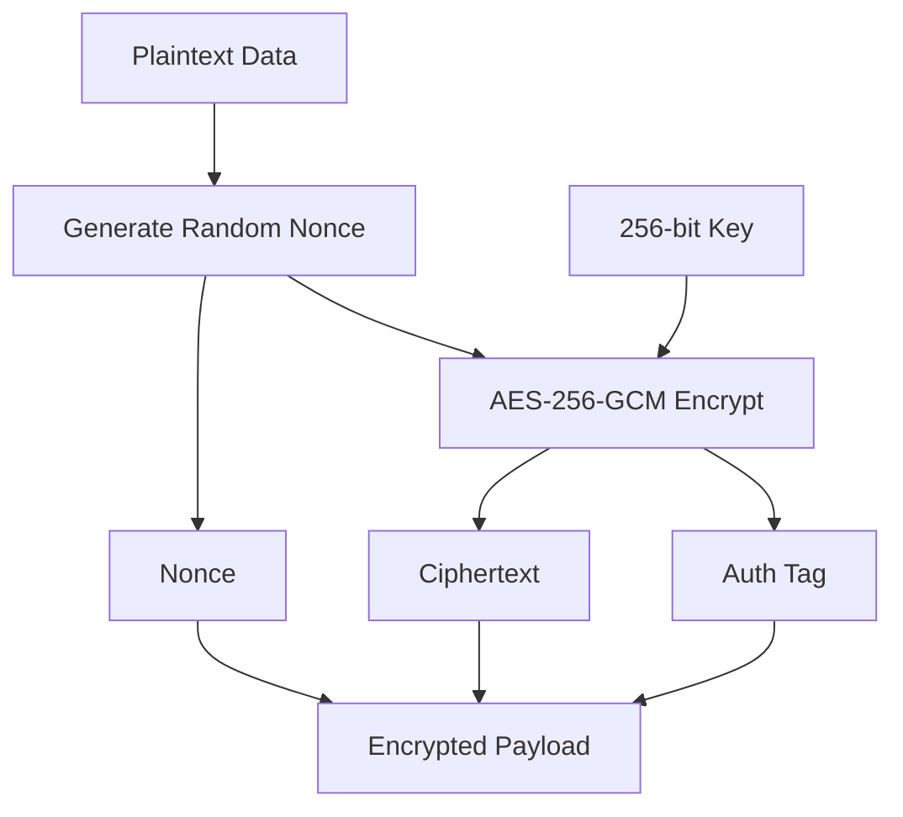

# HELIX Security Model

## Overview

HELIX implements defense-in-depth security with encryption at rest, integrity verification, and secure key management. All cryptographic operations use well-vetted, industry-standard algorithms.

## Encryption

### Algorithm: AES-256-GCM

- **Cipher**: AES with 256-bit keys (NIST standard)
- **Mode**: GCM (Galois/Counter Mode) — provides authenticated encryption
- **Key size**: 256 bits (32 bytes)
- **Nonce**: 96 bits (12 bytes), randomly generated per encryption operation
- **Tag**: 128-bit authentication tag for integrity verification

### Encryption Process



### Key Management

#### Key Generation

```bash
# Generate a 256-bit key (hex-encoded)
openssl rand -hex 32 > /etc/helix/backup.key
```

#### Key Derivation from Password

HELIX supports deriving encryption keys from passwords using blake3:

```rust
use helix::crypto::encryption::derive_key_from_password;

let key = derive_key_from_password("user-password", b"helix-salt");
```

#### Key Storage Options

| Method | Security Level | Complexity |
|---|---|---|
| Local key file | Medium | Low |
| Hardware Security Module (HSM) | High | High |
| Cloud KMS (AWS KMS, Azure Key Vault, GCP Cloud KMS) | High | Medium |
| Password-derived | Low | None |

## Integrity

### Block-Level Hashing

Every block is hashed with blake3 before storage:

```rust
let hash = blake3::hash(&block_data);
```

- **Algorithm**: blake3 (default, 256-bit output)
- **Coverage**: Every block has its own hash in the manifest
- **Verification**: Hashes are verified during restore

### Repository Integrity

The `helix check` command validates:

1. All manifest files are valid JSON
2. All referenced block data exists
3. Block hash consistency (if enabled)
4. SQLite index consistency

## Authentication

### Repository Authentication

Repository access is controlled by:

1. **File system permissions** on the repository directory
2. **Encryption key** for encrypted repositories
3. **Operating system access controls**

## Secure Storage

### File Permissions

Recommended permissions:

```bash
# Repository directory
chmod 700 /var/helix/backups

# Configuration file (may contain key paths)
chmod 600 /etc/helix/config.yaml

# Key file
chmod 600 /etc/helix/backup.key
```

### Sensitive Data in Memory

HELIX follows security best practices:

- Encryption keys are stored in heap-allocated memory (not stack)
- Keys are zeroed after use where feasible
- Sensitive data is not logged

## Threat Model

### Trust Assumptions

- The backup operator is trusted
- The operating system is not compromised
- Physical access to the backup server is controlled

### Threats Mitigated

| Threat | Mitigation |
|---|---|
| Backup data theft (physical media) | AES-256-GCM encryption |
| Data tampering during transit | GCM authentication tag |
| Accidental data corruption | blake3 integrity hashes |
| Unauthorized backup access | File permissions + encryption |
| Key compromise (single) | Key rotation capability |

### Threats NOT Mitigated

- Compromised operating system
- Compromised encryption key
- Physical destruction of backup media
- Side-channel attacks

## Compliance

### Recommendations for Compliance

| Standard | Recommendation |
|---|---|
| GDPR | Enable encryption, limit retention period |
| HIPAA | Enable encryption, audit logging, access controls |
| SOC 2 | Enable encryption, regular integrity checks, access logging |
| PCI-DSS | Enable encryption, key rotation, access controls |

## Best Practices

1. **Always enable encryption** for production backups
2. **Store keys separately** from backup data
3. **Regular key rotation** (quarterly recommended)
4. **Verify backups** with `helix check`
5. **Test restores** regularly in a staging environment
6. **Use dedicated backup user** with minimal required permissions
7. **Monitor backup logs** for errors or anomalies
8. **Off-site key backup** (printed, in safe)
